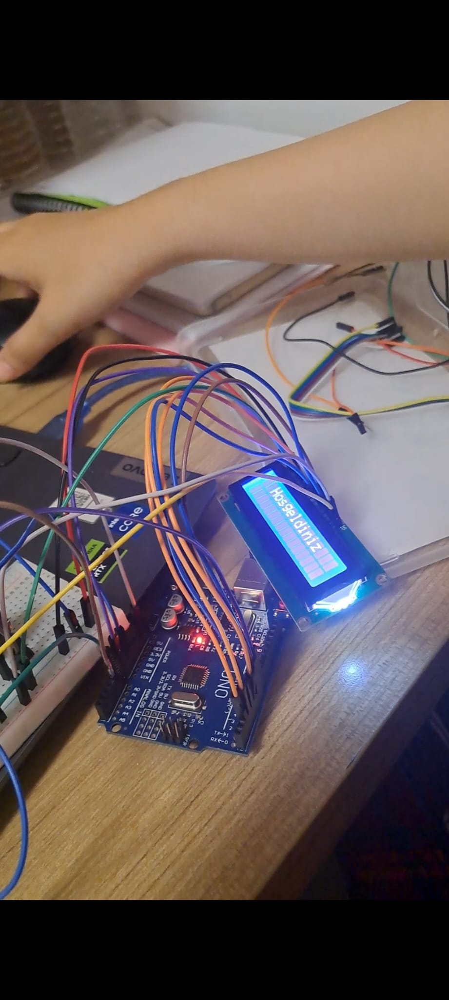
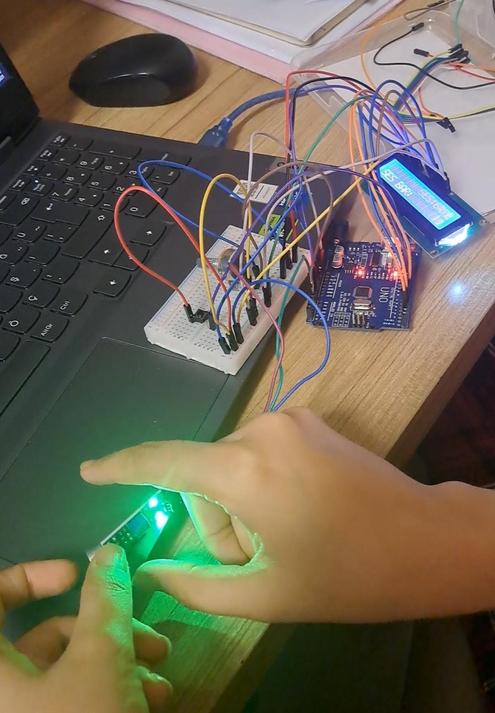

# DUYSENS (Arduino Uno)

Mikrofon modülüyle ortamdaki ses seviyesini ölçüp I2C LCD ekranda yüzde olarak gösteren Arduino projesi.
Ses seviyesi %70 ve üstüne çıkınca LED yanar ve ekranda "Tehlikeli!" uyarısı görünür.

## Nasıl çalışır?

1. Mikrofon modülünün analog çıkışı `A0` pininden okunur (0-1023).
2. Ani dalgalanmaları yumuşatmak için basit bir **alçak geçiren filtre** uygulanır:
   `filtreliSes = filtreliSes * 0.95 + yeniOkuma * 0.05`
3. Filtrelenen değer `map()` ile 0-100 arası yüzdeye çevrilir.
4. LCD'nin ilk satırında `Ses: XX %` gösterilir.
5. Değer **70 veya üzerindeyse** `D8` pinindeki LED yanar ve ikinci satırda `Tehlikeli!` yazar, değilse LED söner ve `Normal` yazar.
6. Döngü 100 ms'de bir tekrarlanır.

## Gerekli malzemeler

- Arduino Uno
- Mikrofon (ses sensörü) modülü
- 16x2 I2C LCD ekran (adres `0x27`)
- LED ve direnç
- Breadboard ve jumper kablolar

## Bağlantılar

| Parça | Arduino Uno |
|---|---|
| Mikrofon modülü (analog çıkış) | `A0` |
| LED (direnç üzerinden) | `D8` |
| LCD I2C `SDA` | `A4` |
| LCD I2C `SCL` | `A5` |
| LCD `VCC` / `GND` | `5V` / `GND` |

## Kurulum

1. [Arduino IDE](https://www.arduino.cc/en/software)'yi kur.
2. **Library Manager**'dan `LiquidCrystal I2C` kütüphanesini kur.
3. `duysens/duysens.ino` dosyasını aç. Klasör adı ile dosya adı aynı olmalıdır.
4. Kartı **Arduino Uno** olarak seç, doğru portu seç ve **Upload**'a bas.

LCD ekranda yazı görünmezse I2C adresi `0x27` yerine `0x3F` olabilir. Koddaki `LiquidCrystal_I2C lcd(0x27, 16, 2);` satırını değiştirerek dene.

## Görseller

